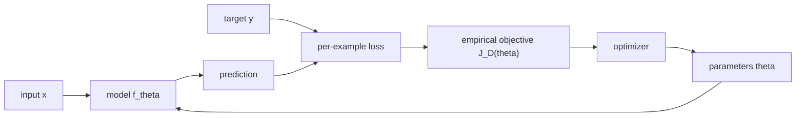
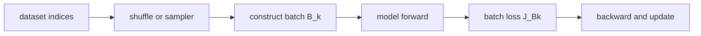

Neural-network training first requires a scalar objective and then a scalable way to query it. This note constructs the learning objective from data, parameters, predictions, and losses; separates zeroth-, first-, and second-order information; and develops full-batch and mini-batch access through sampling, unbiasedness, gradient noise, and batch-size variance. The subjects belong together because mini-batching does not define a different learning goal: it changes the statistical and computational information returned when the same empirical objective is queried.

> [!abstract] Position in the learning graph
> This note continues from *The Gradient, Steepest Descent, and the Guarantees of Gradient Descent*. The earlier note explains what a gradient means and when a gradient step is safe; this note explains **how a large computation graph produces that gradient efficiently**, and what else becomes optimizable once a program is differentiable.
>
> Source: MIT 6.7960 Deep Learning, Fall 2024, Lecture 2, Sara Beery. The slide deck is used as source material rather than as the note's organization.

> [!note] Scope of this concept note
> The roadmap above preserves the broader program stated in the source. This concept note itself stops after the construction and statistical analysis of mini-batch gradient information; it does not claim to develop reverse-mode differentiation or backpropagation below. Its direct predecessor in the split graph is [From Learning Objectives to Gradients]({{ '/notes/mit6-7960-01-1-from-learning-objectives-to-gradients/' | relative_url }}).

## 0.0 Course map

The lecture has one continuous arc:

$$
\boxed{
\text{learning objective}
\to
\text{computation graph}
\to
\text{local derivatives}
\to
\text{backpropagation}
\to
\text{differentiable programming}
}.
$$

| Stage | Central question | Status |
|---|---|---:|
| Learning task $\to$ scalar objective | What exactly is being optimized? | complete |
| Objective oracle | What information can an optimizer query? | complete |
| Mini-batch access | How is a large finite-sum objective queried one subset at a time? | complete |
| Stochastic optimization dynamics | Why can locally unbiased updates follow a noisy multi-step path? | in progress |
| Loss geometry | Which gradients are useful or pathological? | complete |
| Classification surrogate | How does cross-entropy turn confidence into a trainable signal? | complete |
| Derivative-free search | How can function values reveal a useful direction? | complete |
| Computation graphs | How is a network decomposed into local operations? | upcoming |
| Backpropagation | How does reverse mode reuse chain-rule computation? | upcoming |
| Linear layers and MLPs | Where do the matrix and outer-product formulas come from? | upcoming |
| DAGs and parameter sharing | Why do gradients add at merges and shared parameters? | upcoming |
| Differentiable programming | Why can parameters, inputs, and internal nodes all be optimized? | upcoming |

---

## 2.1 From a learning task to a scalar objective

The source slide compresses the complete supervised-learning setup into one picture:

*Source: MIT 6.7960 Fall 2024, Lecture 2, slide 4.*

To understand training, separate the objects that the picture places on one page.

### The five objects

In supervised learning, the dataset is

$$
\mathcal D
=
\left\{
\big(x^{(i)},y^{(i)}\big)
\right\}_{i=1}^N.
$$

| Object | Meaning | Changes during training? |
|---|---|---:|
| $x^{(i)}$ | input, such as an image | no |
| $y^{(i)}$ | target or label | no |
| $f_\theta$ | the function represented by the network | changes through $\theta$ |
| $\theta$ | all trainable weights and biases | yes |
| $\mathcal L$ | the rule that scores a prediction against its target | normally fixed |

> [!important] What moves?
> During ordinary training the data are held fixed and the parameters move. The relevant derivative is therefore with respect to $\theta$. A derivative with respect to the input $x$ answers a different question; input optimization returns in §2.8.

### Architecture defines a function family; parameters choose one member

Writing $f_\theta$ means that one architecture represents a family of functions,

$$
\mathcal F
=
\{f_\theta:\theta\in\Theta\}.
$$

For a two-layer MLP,

$$
f_\theta(x)
=
W_2\sigma(W_1x+b_1)+b_2,
\qquad
\theta=\{W_1,b_1,W_2,b_2\}.
$$

The architecture fixes the compositional template. Training changes the numerical parameter values and thereby chooses a particular function from $\mathcal F$.

> [!tip] Expressivity comes before optimization
> An optimizer can search only inside $\mathcal F$. If the architecture cannot represent the desired input-output relation, a better optimizer cannot create that missing function.

### A prediction becomes trainable only after it becomes a scalar loss

For sample $i$, define

$$
\ell_i(\theta)
=
\mathcal L\!\left(f_\theta(x^{(i)}),y^{(i)}\right).
$$

The dependency is

$$
\theta
\longrightarrow
f_\theta(x^{(i)})
\longrightarrow
\ell_i(\theta).
$$

Although the loss is written as a comparison between prediction and target, it is ultimately a scalar function of the parameters.

For classification, the network commonly produces logits $z_\theta(x)$, which softmax converts into probabilities:

$$
p_\theta(y=c\mid x)
=
\frac{e^{z_c}}{\sum_j e^{z_j}}.
$$

The cross-entropy loss for the correct class is

$$
\boxed{
\ell_i(\theta)
=
-\log p_\theta\!\left(y^{(i)}\mid x^{(i)}\right)
}.
$$

| Probability assigned to the correct class | Cross-entropy | Interpretation |
|---:|---:|---|
| $0.99$ | $0.010$ | correct and highly confident |
| $0.90$ | $0.105$ | good prediction |
| $0.50$ | $0.693$ | uncertain |
| $0.10$ | $2.303$ | poor prediction |
| $0.01$ | $4.605$ | confidently wrong |

> [!important] Loss is a training signal; a metric is an evaluation summary
> Accuracy is piecewise constant: increasing the correct-class probability from $0.01$ to $0.40$ may leave accuracy at zero even though the model improved substantially. Cross-entropy changes continuously and supplies a graded signal. We therefore often **train with a differentiable surrogate** and **report a task metric**; they need not be the same function.
>
> The full probability, information-theoretic, maximum-likelihood, and gradient derivations appear in [Stochastic Gradient Steps and Trainable Loss Geometry: Cross-entropy]({{ '/notes/mit6-7960-02-2-stochastic-gradient-steps-and-trainable-loss-geometry/#cross-entropy-turning-classification-into-a-trainable-signal' | relative_url }}).

### Aggregating examples creates the empirical objective

The per-example losses are averaged to form the empirical risk,

$$
\boxed{
J_{\mathcal D}(\theta)
=
\frac1N\sum_{i=1}^N\ell_i(\theta)
}.
$$

Once $\mathcal D$, $f_\theta$, and $\mathcal L$ are fixed, they induce one scalar landscape over parameter space:

$$
\boxed{
\mathcal D+f_\theta+\mathcal L
\quad\longrightarrow\quad
J_{\mathcal D}(\theta)
}.
$$

> [!insight] The loss landscape is induced, not intrinsic
> The landscape is not a property of the architecture alone. Changing the dataset, labels, loss, regularizer, or parameterization changes the function $J_{\mathcal D}(\theta)$ that the optimizer sees.

> [!example]- One parameter: watch a dataset become a parabola
> Let
> $$
> f_\theta(x)=\theta x
> $$
> and use the two samples
> $$
> (x^{(1)},y^{(1)})=(1,2),
> \qquad
> (x^{(2)},y^{(2)})=(2,4).
> $$
> With squared error $\ell_i(\theta)=(f_\theta(x^{(i)})-y^{(i)})^2$,
> $$
> \begin{aligned}
> J(\theta)
> &=\frac12\left[(\theta-2)^2+(2\theta-4)^2\right]\\
> &=\frac52(\theta-2)^2.
> \end{aligned}
> $$
>
> | $\theta$ | predictions | $J(\theta)$ |
> |---:|---:|---:|
> | $0$ | $(0,0)$ | $10$ |
> | $1$ | $(1,2)$ | $2.5$ |
> | $2$ | $(2,4)$ | $0$ |
> | $3$ | $(3,6)$ | $2.5$ |
>
> The optimizer does not need the semantic statement “the targets follow $y=2x$.” It interacts with the scalar function $J(\theta)=\tfrac52(\theta-2)^2$ induced by those data.

### Sum and mean have the same minimizers but different scales

The source slide uses a sum. A positive constant does not change the minimizer set:

$$
\operatorname*{arg\,min}_\theta
\sum_{i=1}^N\ell_i(\theta)
=
\operatorname*{arg\,min}_\theta
\frac1N\sum_{i=1}^N\ell_i(\theta).
$$

But the gradients differ by $N$:

$$
\nabla J_{\mathrm{sum}}(\theta)
=
N\nabla J_{\mathrm{mean}}(\theta).
$$

> [!warning] Same optimum does not mean same optimization dynamics
> Replacing a mean by a sum preserves the minimizing parameters but rescales every gradient, so it changes the learning-rate scale. The mean is usually preferable because duplicating the dataset leaves the average loss unchanged.

### `min` returns a value; `argmin` returns locations

The training problem is

$$
\theta^*
\in
\operatorname*{arg\,min}_\theta J_{\mathcal D}(\theta).
$$

| Expression | Returns |
|---|---|
| $\min_\theta J(\theta)$ | the smallest objective value |
| $\operatorname*{arg\,min}_\theta J(\theta)$ | all parameters attaining that value |

For $J(\theta)=\tfrac52(\theta-2)^2$,

$$
\min_\theta J(\theta)=0,
\qquad
\operatorname*{arg\,min}_\theta J(\theta)=\{2\}.
$$

In a deep network, the minimizer is rarely unique. Permuting hidden units and applying the corresponding permutation to the next layer can produce different parameters with exactly the same function:

$$
\theta_1\ne\theta_2,
\qquad
f_{\theta_1}=f_{\theta_2},
\qquad
J(\theta_1)=J(\theta_2).
$$

The training goal is therefore not generally to recover one uniquely “true” parameter vector.

### Three targets that must remain separate

The ideal population risk is

$$
R(\theta)
=
\mathbb E_{(x,y)\sim\mathcal P}
\left[
\mathcal L(f_\theta(x),y)
\right],
$$

where $\mathcal P$ is the unknown data-generating distribution. Training instead evaluates the finite-sample objective $J_{\mathcal D}$, and a finite optimization run returns an iterate $\theta_T$ rather than an exact minimizer.

$$
\boxed{
\text{desired: low }R(\theta)
\qquad
\text{optimized: }J_{\mathcal D}(\theta)
\qquad
\text{returned: }\theta_T
}.
$$

> [!warning] Optimization is not generalization
> Lowering $J_{\mathcal D}$ shows progress on the chosen finite training objective. It does not by itself prove that $R$ decreases on unseen data. This boundary links back to [Conditioning and Practical Gradient Descent]({{ '/notes/mit6-7960-01-5-conditioning-and-practical-gradient-descent/' | relative_url }}).

---

## 2.2 The objective as an information interface

After the learning problem has been compressed into $J(\theta)$, an optimizer can treat it as an oracle:

$$
\theta
\longmapsto
\boxed{J}
\longmapsto
\text{information returned at }\theta.
$$

The optimizer does not receive a global map of the loss landscape. Its method depends on what local information the oracle can provide.

| Available query | Optimization class | Local meaning |
|---|---|---|
| $J(\theta)$ | zeroth-order / black-box | how poor the current point is |
| $J(\theta)$ and $\nabla J(\theta)$ | first-order | which infinitesimal changes raise or lower the objective |
| $J(\theta)$, $\nabla J(\theta)$, and $H(\theta)$ | second-order | how those slopes themselves change with direction |

For the one-parameter objective

$$
J(\theta)=\frac52(\theta-2)^2,
$$

the information at $\theta=0$ is

$$
J(0)=10,
\qquad
J'(0)=-10,
\qquad
J''(0)=5.
$$

- The value $10$ says only that the present parameter is poor.
- The negative slope says that a small increase in $\theta$ lowers the objective.
- The positive second derivative says that the slope increases with $\theta$ and the local curve bends upward.

Indeed, for small $\Delta$,

$$
J(0+\Delta)
\approx
J(0)+J'(0)\Delta
=
10-10\Delta.
$$

This is the first-order information that gradient-based methods exploit. The geometric meaning of the gradient and the conditions under which a finite step decreases the objective were developed in [Differentiability, Directional Derivatives, and Steepest Descent]({{ '/notes/mit6-7960-01-2-differentiability-directional-derivatives-and-steepest-descent/' | relative_url }}).

> [!important] Why deep learning is dominated by first-order methods
> If a network has $P$ parameters, the gradient has $P$ entries, while the full Hessian has $P^2$ entries. Backpropagation will let us compute the complete gradient by reusing the computation graph, without performing one separate forward evaluation per parameter. This computational fact—not a claim that curvature is irrelevant—makes first-order optimization the default at deep-learning scale.

> [!tip] Keep the responsibilities separate
> **The loss defines the scalar objective. Backpropagation computes derivatives of that objective. The optimizer decides how to use those derivatives to change the parameters.** None of the three is interchangeable with the others.

### Full-batch and mini-batch access to the objective

The empirical objective is defined by the complete training set,

$$
\mathcal D
=
\left\{
(x^{(i)},y^{(i)})
\right\}_{i=1}^{N},
$$

with per-example loss

$$
\ell_i(\theta)
=
\mathcal L\!\left(
f_\theta(x^{(i)}),y^{(i)}
\right).
$$

The full mean objective and its gradient are

$$
\boxed{
J_{\mathcal D}(\theta)
=
\frac1N
\sum_{i=1}^{N}\ell_i(\theta)
},
$$

$$
\boxed{
\nabla J_{\mathcal D}(\theta)
=
\frac1N
\sum_{i=1}^{N}
\nabla\ell_i(\theta)
}.
$$

#### Full-batch gradient descent

Full-batch gradient descent evaluates every training example before each parameter update:

$$
\boxed{
\theta_{k+1}
=
\theta_k
-
\eta\nabla J_{\mathcal D}(\theta_k)
}.
$$

One update requires processing all $N$ examples, computing their contributions, averaging them, and only then changing the parameters. If $N=1{,}000{,}000$, every step must process one million examples.

The result uses the exact gradient of the finite training objective, but each update can be slow and may require more activation memory than the hardware can hold.

#### A mini-batch is one temporary subset for one update

At step $k$, choose an index set

$$
B_k
\subset
\{1,\ldots,N\}
$$

with batch size

$$
|B_k|=b.
$$

The temporary batch objective and gradient are

$$
\boxed{
J_{B_k}(\theta)
=
\frac1b
\sum_{i\in B_k}
\ell_i(\theta)
},
$$

$$
\boxed{
g_{B_k}(\theta)
=
\nabla J_{B_k}(\theta)
=
\frac1b
\sum_{i\in B_k}
\nabla\ell_i(\theta)
}.
$$

The parameter update uses that batch gradient:

$$
\boxed{
\theta_{k+1}
=
\theta_k
-
\eta g_{B_k}(\theta_k)
}.
$$

The complete objective remains $J_{\mathcal D}$. The batch objective $J_{B_k}$ is only the subset seen by one update; the next step normally uses another subset.

> [!important] Mini-batch does not mean a permanently smaller dataset
> Training does not normally select one small subset and ignore the rest forever. The sequence
> $$
> B_1,B_2,B_3,\ldots
> $$
> changes across steps, and one pass through the batches normally covers the complete training set.

#### Step and epoch measure different things

A **step**, or iteration, is one parameter update:

$$
\theta_k
\longrightarrow
\theta_{k+1}.
$$

An **epoch** is one pass through the full training set.

For

$$
N=10{,}000,
\qquad
b=100,
$$

one epoch contains approximately

$$
\frac Nb
=
100
$$

mini-batch steps. Full-batch training has $b=N$, so one epoch contains one update.

$$
\boxed{
\text{epoch measures data coverage;}
\qquad
\text{step measures parameter updates.}
}
$$

#### Why use mini-batches?

| Constraint | Full batch | Mini-batch response |
|---|---|---|
| time per update | processes all $N$ examples | produces an update after $b\ll N$ examples |
| activation memory | may exceed device capacity | restricts simultaneous examples to a manageable block |
| accelerator use | one example may underuse matrix hardware | stacks multiple examples for parallel matrix computation |
| update frequency | one update per complete pass | many updates per epoch |

Mini-batching is therefore a compromise:

| Regime | Batch size | Character |
|---|---:|---|
| single-example update | $b=1$ | most frequent updates, least information per step |
| mini-batch update | $1<b<N$ | compromise between parallel computation and update frequency |
| full-batch update | $b=N$ | exact finite-dataset gradient, most expensive step |

This table does not yet claim that a batch gradient is accurate or unbiased. That requires a sampling model, introduced next.

### How is $B_k$ selected?

The standard practical construction is:

1. randomly permute the $N$ training indices at the beginning of an epoch;
2. split the permutation into consecutive blocks of size $b$;
3. use one block per parameter update;
4. reshuffle before the next epoch.

If

$$
\pi
=
(\pi_1,\ldots,\pi_N)
$$

is a random permutation, then an interior batch can be written as

$$
\boxed{
B_k
=
\left\{
\pi_{(k-1)b+1},
\ldots,
\pi_{kb}
\right\}.
}
$$

For example, with $N=10$ and $b=3$, one permutation might be

$$
(7,2,9,1,5,10,4,8,3,6).
$$

It produces

$$
B_1=\{7,2,9\},
\qquad
B_2=\{1,5,10\},
$$

$$
B_3=\{4,8,3\},
\qquad
B_4=\{6\}.
$$

Randomization avoids preserving systematic ordering such as all cat examples followed by all dog examples. Without shuffling, successive updates could alternately over-specialize to long homogeneous blocks.

> [!important] Random does not mean perfectly representative
> A random batch can still contain an unusual class mixture or difficult examples. Randomization prevents persistent ordering bias; it does not guarantee that every individual batch exactly matches the full dataset.

#### What happens to an incomplete final batch?

If $N$ is not divisible by $b$, the last batch contains fewer than $b$ examples. Two common choices are:

| Choice | Benefit | Cost |
|---|---|---|
| keep the smaller final batch | every example is used | batch shape and some statistics differ on the last step |
| drop the final batch | all steps have the same batch size | a small set of examples is omitted in that epoch |

The omitted examples can change after the next reshuffle; “drop the last batch” need not discard the same training examples forever.

#### Without replacement versus with replacement

Shuffle-and-split is sampling **without replacement** within an epoch:

$$
B_i\cap B_j=\varnothing
\qquad
(i\ne j),
$$

and, if the final batch is retained,

$$
\bigcup_k B_k
=
\{1,\ldots,N\}.
$$

Each example appears once in that epoch.

Mathematical analyses often model each batch as an independent sample **with replacement**. Then an example may be selected more than once while another may not be selected in the same nominal pass. This model is easier to analyze because draws are independent, but it is not identical to shuffle-and-split data loading.

#### The data pipeline, not the model, normally constructs $B_k$

The random seed controls whether the sequence of permutations is reproducible. The model does not normally choose the easiest or hardest examples by itself.

#### Important exceptions

Uniform shuffle-and-split is the baseline for ordinary independently labeled examples, but not every dataset permits it:

- time series may require temporal order or carefully constructed windows;
- language models usually form examples from contiguous token spans;
- highly imbalanced classification may use stratified or weighted sampling;
- distributed training must partition examples across workers without unintended duplication.

These schemes change the sampling distribution and therefore change what the resulting batch gradient represents. Until those cases are studied explicitly, the default assumption will be:

$$
\boxed{
\text{uniform random shuffle without replacement, followed by blocks of size }b.
}
$$

### Why a uniformly sampled batch gradient is unbiased

Fix the parameter vector $\theta$ and write the contribution of example $i$ as

$$
g_i(\theta)
=
\nabla\ell_i(\theta).
$$

The full finite-dataset gradient is the mean of all per-example gradients:

$$
\boxed{
\nabla J_{\mathcal D}(\theta)
=
\frac1N
\sum_{i=1}^{N}g_i(\theta)
}.
$$

The question is not whether one batch equals this full mean—it usually does not—but whether the sampling procedure systematically favors some direction.

#### Begin with one uniformly sampled example

Let the random index $I$ be uniform on

$$
\{1,\ldots,N\}.
$$

Then every example has probability

$$
\Pr(I=i)=\frac1N.
$$

The expected sampled gradient is

$$
\begin{aligned}
\mathbb E_I[g_I(\theta)]
&=
\sum_{i=1}^{N}
\Pr(I=i)g_i(\theta)\\
&=
\sum_{i=1}^{N}
\frac1N g_i(\theta)\\
&=
\frac1N
\sum_{i=1}^{N}g_i(\theta)\\
&=
\nabla J_{\mathcal D}(\theta).
\end{aligned}
$$

Therefore,

$$
\boxed{
\mathbb E_I[g_I(\theta)]
=
\nabla J_{\mathcal D}(\theta).
}
$$

The expectation is a hypothetical average over repeated random draws while holding $\theta$ fixed. It does not say that the gradient of one randomly chosen example equals the full gradient.

> [!important] Unbiased does not mean exact
> An estimator $G$ is unbiased for a target $g$ when
> $$
> \mathbb E[G]=g.
> $$
> Individual realizations may still be far from $g$. Unbiasedness rules out systematic error in the sampling average; it does not rule out randomness around that average.

#### A uniformly sampled batch of size $b$

Let $B$ be selected uniformly from all subsets of size $b$, and define

$$
g_B(\theta)
=
\frac1b
\sum_{i\in B}g_i(\theta).
$$

Introduce an indicator for each example:

$$
X_i
=
\begin{cases}
1,&i\in B,\\
0,&i\notin B.
\end{cases}
$$

Then

$$
g_B(\theta)
=
\frac1b
\sum_{i=1}^{N}
X_i g_i(\theta).
$$

Because $B$ is a uniform subset of size $b$, every example has the same inclusion probability:

$$
\Pr(i\in B)
=
\frac bN.
$$

Since $X_i$ takes only the values zero and one,

$$
\mathbb E[X_i]
=
1\cdot\Pr(i\in B)
+
0\cdot\Pr(i\notin B)
=
\frac bN.
$$

Using linearity of expectation,

$$
\begin{aligned}
\mathbb E_B[g_B(\theta)]
&=
\mathbb E_B
\left[
\frac1b
\sum_{i=1}^{N}X_i g_i(\theta)
\right]\\
&=
\frac1b
\sum_{i=1}^{N}
\mathbb E[X_i]g_i(\theta)\\
&=
\frac1b
\sum_{i=1}^{N}
\frac bN g_i(\theta)\\
&=
\frac1N
\sum_{i=1}^{N}g_i(\theta)\\
&=
\nabla J_{\mathcal D}(\theta).
\end{aligned}
$$

Hence

$$
\boxed{
\mathbb E_B[g_B(\theta)]
=
\nabla J_{\mathcal D}(\theta).
}
$$

Dividing by $b$ is essential. The expected **sum** of batch gradients is $b$ times the full mean; the expected batch **average** has the correct scale.

#### A complete four-example calculation

Suppose the one-dimensional per-example gradients at the current parameter are

$$
g_1=2,
\qquad
g_2=4,
\qquad
g_3=6,
\qquad
g_4=8.
$$

The full gradient is

$$
\nabla J_{\mathcal D}
=
\frac{2+4+6+8}{4}
=
5.
$$

For a uniform batch of two distinct examples, all possible batch gradients are:

| Batch | Batch gradient |
|---|---:|
| $\{1,2\}$ | $(2+4)/2=3$ |
| $\{1,3\}$ | $(2+6)/2=4$ |
| $\{1,4\}$ | $(2+8)/2=5$ |
| $\{2,3\}$ | $(4+6)/2=5$ |
| $\{2,4\}$ | $(4+8)/2=6$ |
| $\{3,4\}$ | $(6+8)/2=7$ |

Their uniform average is

$$
\frac{3+4+5+5+6+7}{6}
=
5,
$$

which equals the full gradient.

One batch may report $3$ or $7$ even though the full gradient is $5$. The estimator is unbiased because low and high deviations balance over the sampling distribution—not because every batch is representative.

#### Relation to shuffle-and-split

For a uniformly random permutation, a batch occupying a fixed block of positions—for example

$$
B_1
=
\{\pi_1,\ldots,\pi_b\}
$$

—is marginally a uniform subset of size $b$. Before the permutation is revealed,

$$
\mathbb E[g_{B_1}(\theta)]
=
\nabla J_{\mathcal D}(\theta).
$$

The same marginal statement holds for any fixed block in the permutation. However, batches within the same epoch are not independent: once an example appears in $B_1$, it cannot appear again in $B_2$ under sampling without replacement.

Conditioned on the batches already revealed, the next batch is uniform over the **remaining** examples rather than the complete dataset. This dependence is why shuffle-without-replacement training is not literally identical to drawing an independent batch with replacement at every step.

#### The training-time statement is conditional on the current parameters

During optimization, $\theta_k$ changes from one step to the next. The precise one-step statement is therefore

$$
\boxed{
\mathbb E
\left[
g_{B_k}(\theta_k)
\mid
\theta_k
\right]
=
\nabla J_{\mathcal D}(\theta_k),
}
$$

under fresh independent uniform sampling, as in the with-replacement model used in many analyses. The conditioning bar means: hold the current parameter vector fixed, then average only over the random choice of the next batch. Under shuffle without replacement, conditioning on the revealed history instead gives the mean gradient of the remaining examples; the marginal unbiased statement still holds before the epoch permutation is revealed.

> [!warning] Nonuniform samplers change the represented objective
> If difficult examples, rare classes, or particular data sources are selected with larger probability, an unweighted batch mean generally no longer estimates the uniform empirical objective. It estimates a sampling-weighted objective unless importance weights correct the unequal selection probabilities.

The two statements to keep separate are

$$
\boxed{
g_B(\theta)
\ne
\nabla J_{\mathcal D}(\theta)
\quad
\text{for a typical individual batch},
}
$$

but

$$
\boxed{
\mathbb E_B[g_B(\theta)]
=
\nabla J_{\mathcal D}(\theta)
\quad
\text{under uniform sampling}.
}
$$

### Gradient noise: what batch size actually controls

Unbiasedness identifies the **center** of the batch-gradient distribution. It does not describe how widely individual batch gradients scatter around that center. Define the batch-gradient noise at a fixed parameter vector by

$$
\boxed{
\xi_B(\theta)
:=
g_B(\theta)-\nabla J_{\mathcal D}(\theta)
}.
$$

Equivalently,

$$
\boxed{
g_B(\theta)
=
\nabla J_{\mathcal D}(\theta)+\xi_B(\theta).
}
$$

Under uniform sampling, unbiasedness becomes

$$
\mathbb E_B[\xi_B(\theta)]=0.
$$

This zero mean does **not** say that the noise vanishes. Its size can be measured by the mean squared distance from the full gradient:

$$
\boxed{
\operatorname{Var}(g_B)
:=
\mathbb E_B
\left[
\left\lVert
g_B(\theta)-\nabla J_{\mathcal D}(\theta)
\right\rVert_2^2
\right]
=
\mathbb E_B\!\left[\lVert\xi_B(\theta)\rVert_2^2\right].
}
$$

For a vector-valued gradient this scalar is the **total variance**: the sum of the coordinate-wise variances. A covariance matrix contains more directional information, but this scalar already captures the typical noise magnitude.

#### The four-example calculation, now viewed through variance

Return to

$$
(g_1,g_2,g_3,g_4)=(2,4,6,8),
\qquad
\nabla J_{\mathcal D}=5.
$$

For batch size $b=1$, the possible estimates are $2,4,6,8$, so

$$
\operatorname{Var}(g_B)
=
\frac{(2-5)^2+(4-5)^2+(6-5)^2+(8-5)^2}{4}
=5.
$$

For uniform batches of two distinct examples, the six estimates are

$$
3,4,5,5,6,7,
$$

and therefore

$$
\operatorname{Var}(g_B)
=
\frac{(3-5)^2+(4-5)^2+0^2+0^2+(6-5)^2+(7-5)^2}{6}
=
\frac53.
$$

For $b=4$, the batch is the full dataset, so the only possible estimate is $5$ and the variance is zero.

| Batch size | Possible batch gradients | Mean | Variance around the full gradient |
|---:|---|---:|---:|
| $1$ | $2,4,6,8$ | $5$ | $5$ |
| $2$ | $3,4,5,5,6,7$ | $5$ | $5/3$ |
| $4$ | $5$ | $5$ | $0$ |

The batch size changes the scatter of the estimator, not the full empirical objective being estimated. Larger batches average away more disagreement among examples.

#### Why variance decreases approximately as $1/b$

Define the one-example gradient variance at the current parameter vector by

$$
\sigma_g^2(\theta)
:=
\frac1N
\sum_{i=1}^{N}
\left\lVert
g_i(\theta)-\nabla J_{\mathcal D}(\theta)
\right\rVert_2^2.
$$

If $b$ examples are sampled independently and uniformly **with replacement**, averaging independent zero-mean deviations gives

$$
\boxed{
\mathbb E_B
\left[
\left\lVert
g_B(\theta)-\nabla J_{\mathcal D}(\theta)
\right\rVert_2^2
\right]
=
\frac{\sigma_g^2(\theta)}{b}.
}
$$

Thus the variance falls as $1/b$. The typical distance from the full gradient—analogous to a standard deviation—falls only as

$$
\boxed{
\text{typical gradient-noise magnitude}
\propto
\frac1{\sqrt b}.
}
$$

Consequently, making the batch four times larger gives roughly half as much typical gradient noise, not one quarter as much.

For a uniform batch of $b$ distinct examples sampled **without replacement**, the exact finite-dataset correction is

$$
\boxed{
\mathbb E_B
\left[
\left\lVert
g_B(\theta)-\nabla J_{\mathcal D}(\theta)
\right\rVert_2^2
\right]
=
\frac{\sigma_g^2(\theta)}{b}
\frac{N-b}{N-1}.
}
$$

The factor

$$
\frac{N-b}{N-1}
$$

is the finite-population correction. It records that distinct draws are not independent and that uncertainty must become exactly zero when $b=N$.

> [!tip] The practical scaling law
> When $b\ll N$, the correction factor is close to one, so both sampling models behave approximately like
> $$
> \operatorname{Var}(g_B)\approx\frac{\sigma_g^2}{b}.
> $$
> When $b$ becomes a substantial fraction of the dataset, the without-replacement correction matters.

#### The noise enters the parameter update

If a training step uses the batch gradient, then

$$
\theta_{k+1}
=
\theta_k-\eta g_{B_k}(\theta_k).
$$

Substituting the signal-plus-noise decomposition gives

$$
\boxed{
\theta_{k+1}
=
\theta_k
-\eta\nabla J_{\mathcal D}(\theta_k)
-\eta\xi_k.
}
$$

The update therefore contains two pieces:

| Term | Meaning |
|---|---|
| $-\eta\nabla J_{\mathcal D}(\theta_k)$ | deterministic full-objective descent signal |
| $-\eta\xi_k$ | random displacement caused by the chosen batch |

Both learning rate and batch size control the realized randomness: increasing $b$ reduces the noise already present in $g_{B_k}$, while multiplying by $\eta$ scales how strongly that noise moves the parameters.

> [!important] The central tradeoff
> A small batch is cheap and permits frequent updates, but each update is noisy. A large batch gives a more stable direction, but costs more computation and memory per update. The largest possible batch is therefore not automatically the most efficient choice.

The key conceptual separation is

$$
\boxed{
\text{batch size controls estimator noise; it does not redefine the intended full-data objective}
}
$$

provided the sampler remains uniform. A nonuniform sampler can change both the noise and the objective represented by the unweighted batch average.

## Connections

- The general learning-to-optimization abstraction underlying this construction is developed in [From Learning Objectives to Gradients]({{ '/notes/mit6-7960-01-1-from-learning-objectives-to-gradients/' | relative_url }}).
- The batch-gradient estimator defined here is inserted into a complete stochastic update in [Stochastic Gradient Steps and Trainable Loss Geometry]({{ '/notes/mit6-7960-02-2-stochastic-gradient-steps-and-trainable-loss-geometry/' | relative_url }}).
